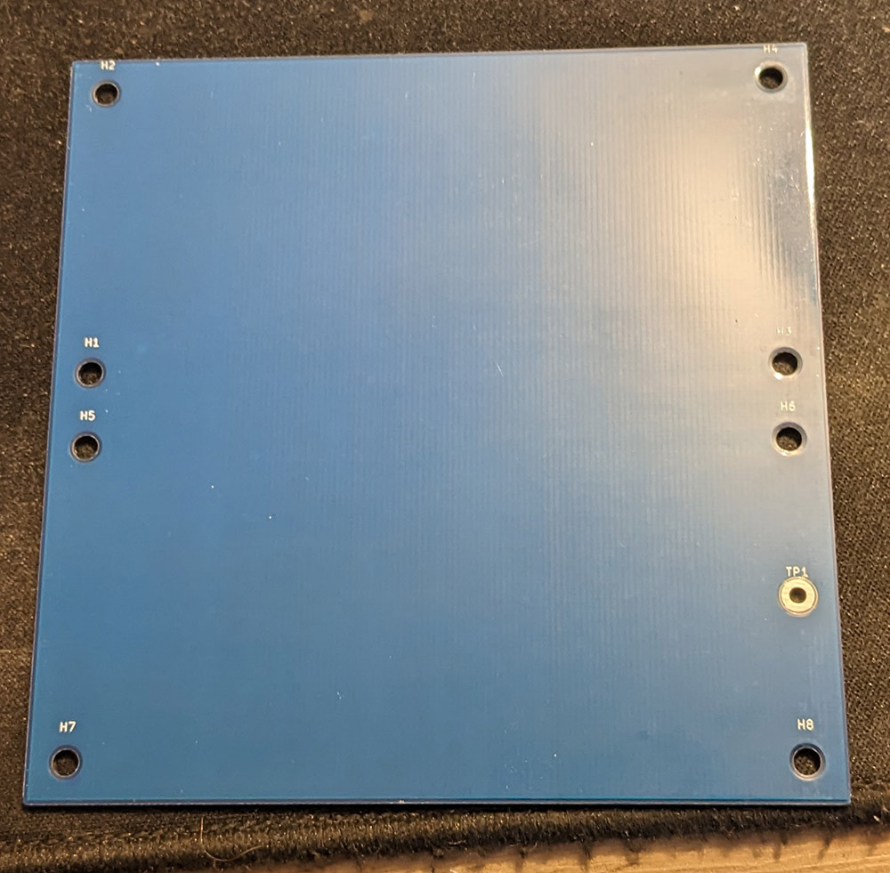
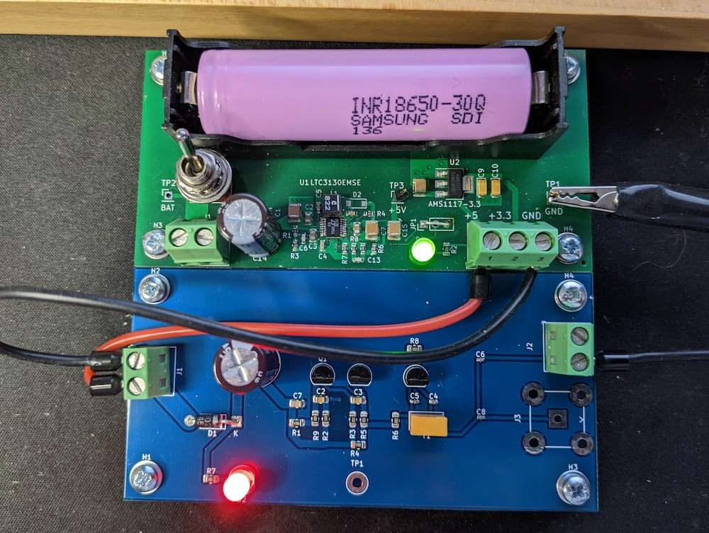

# Max100x100Plate
 
This is a base plate and template for Max 100x100 modules.  A single 100x100 board or two [50x100 boards](https://github.com/AndrewFischer/Max50x100Plate) mount on the 100x100 plate.    

The design rules constraints are set for JLCPCB capabilites. Use the board as template or import the settings into your PCB.  

The design rule constraints and predefined sizes are a **starting point** for new layouts.  
 
 
## TBD
Improved constraints
### License
[cc-by-nc 4.0](LICENSE.md)
